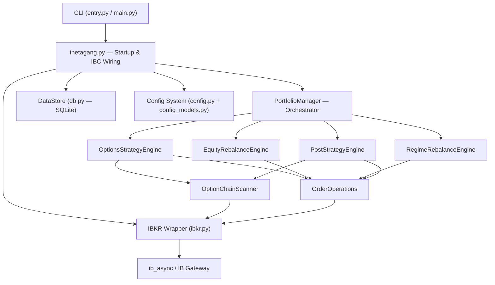
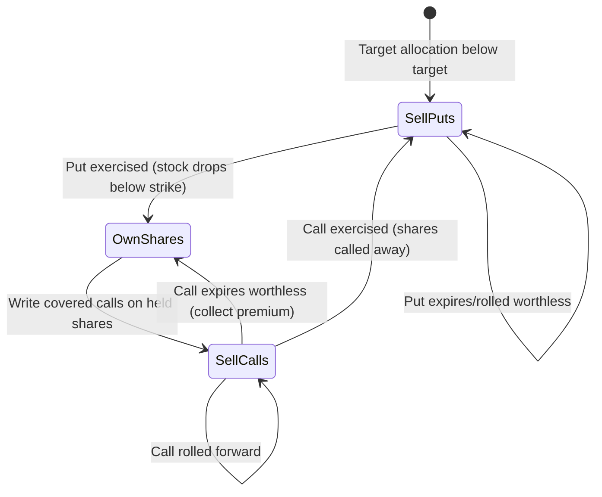

# ThetaGang: Architecture, Strategy & Critical Analysis

## 1. Architecture Overview

ThetaGang is a Python-based automated options trading bot that connects to Interactive Brokers (IBKR) via the `ib_async` library. It implements a modified "Wheel" strategy with configurable portfolio automation, VIX tail hedging, cash management, and regime-aware rebalancing.

### System Architecture Diagram



### Module Responsibilities

| Module | Lines | Purpose |
|--------|------:|---------|
| [portfolio_manager.py](file:///Users/samir/thetagang/thetagang/portfolio_manager.py) | 1,208 | **Central orchestrator.** Initializes engines, runs the `manage()` loop through configurable stage pipeline, delegates to strategy engines, handles order submission and price adjustment. |
| [options_engine.py](file:///Users/samir/thetagang/thetagang/strategies/options_engine.py) | 1,283 | **Core Wheel strategy.** Put writing (position acquisition), call writing (income generation), rolling (position management), closing (profit-taking). |
| [regime_engine.py](file:///Users/samir/thetagang/thetagang/strategies/regime_engine.py) | 1,100 | **Regime-aware rebalancing.** Builds proxy price series, computes choppiness/efficiency regime filters, manages soft/hard bands, flow trades, and deficit rails. |
| [equity_engine.py](file:///Users/samir/thetagang/thetagang/strategies/equity_engine.py) | 524 | **Direct stock rebalancing.** Buy-only, sell-only, and bidirectional equity trades to maintain target allocations without options. |
| [post_engine.py](file:///Users/samir/thetagang/thetagang/strategies/post_engine.py) | 251 | **Post-trade operations.** VIX call hedging (tail risk protection) and cash management (SGOV/treasury ETF parking). |
| [trading_operations.py](file:///Users/samir/thetagang/thetagang/trading_operations.py) | 362 | **Order creation & option chain scanning.** Finds eligible contracts by delta, DTE, strike limits, open interest, and price filters. |
| [ibkr.py](file:///Users/samir/thetagang/thetagang/ibkr.py) | 520 | **Broker abstraction.** Wraps `ib_async` with timeout handling, field validation, market data requests, and trade submission. |
| [config.py](file:///Users/samir/thetagang/thetagang/config.py) | 803 | **Configuration models & stage DAG.** Pydantic v2 models, stage ordering with dependency resolution, symbol config resolution. |
| [config_models.py](file:///Users/samir/thetagang/thetagang/config_models.py) | 651 | **Config sub-models.** Account, orders, IBC, watchdog, symbol-level, VIX hedge, cash management configs. |
| [db.py](file:///Users/samir/thetagang/thetagang/db.py) | ~650 | **Persistence layer.** SQLite via SQLAlchemy/Alembic for order history, executions, account snapshots, event logging. |

### Execution Pipeline

The `manage()` method in `PortfolioManager` runs a **configurable stage pipeline**:

```
1. options_write_puts      — Sell puts to acquire shares at target allocation
2. options_write_calls     — Sell covered calls on held shares
3. equity_regime_rebalance — Regime-filtered share rebalancing
4. equity_buy_rebalance    — Direct stock purchases (buy-only symbols)
5. equity_sell_rebalance   — Direct stock sales (sell-only symbols)
6. options_roll_positions  — Roll expiring/profitable options forward
7. options_close_positions — Close positions at P&L thresholds
8. post_vix_call_hedge     — Buy VIX calls for tail protection
9. post_cash_management    — Park excess cash in treasury ETFs
```

Stages can be enabled/disabled independently and have explicit dependency ordering (e.g., call writing depends on put writing for target share quantities).

---

## 2. The Theta Strategy: How It Works

### Core Premise

The strategy monetizes the **volatility risk premium** — the empirical observation that implied volatility (what option buyers pay) tends to exceed realized volatility (what actually happens). By systematically selling options, ThetaGang collects premium that, on average, exceeds the cost of adverse moves.

### The Wheel Lifecycle



### Phase 1: Put Writing (Position Acquisition)

Instead of buying shares directly, ThetaGang **sells cash-secured puts** at target delta (default 0.3):

1. **Target calculation**: `target_quantity = (symbol_weight × buying_power) / market_price`
2. **Gap calculation**: `puts_needed = (target_quantity - current_shares - 100 × short_puts) / 100`
3. **Contract selection**: Scans option chains for contracts matching target DTE (default 45 days), delta ≤ 0.3, minimum open interest ≥ 10
4. **Rate limiting**: Caps new contracts at `maximum_new_contracts_percent` (default 5%) of buying power per run
5. **Conditional gates**: Only writes puts when the underlying is red (`write_when.puts.red = true`), and optionally requires the daily move to exceed a threshold (absolute % or sigma-based)

> **Key mechanic**: The strike limit for new puts is capped at `old_strike + (premium_received / multiplier)` to prevent over-ratcheting buying power.

### Phase 2: Call Writing (Income Generation)

When shares are held (from exercised puts or direct purchase):

1. **Target calls**: Calculated via `get_target_calls()` considering `cap_factor`, `cap_target_floor`, and `excess_only` settings
2. **Strike floor**: Calls are written at strikes **at or above** the average cost of held shares, preventing selling at a loss
3. **Conditional gates**: Only writes calls on green days (`write_when.calls.green = true`)
4. **High water mark**: Optional `maintain_high_water_mark` prevents rolling calls down to lower strikes

### Phase 3: Rolling (Position Management)

Positions are rolled when:
- **P&L trigger**: Position P&L ≥ `roll_when.pnl` (default 90%)
- **DTE trigger**: DTE ≤ `roll_when.dte` (default 15 days) AND P&L ≥ `roll_when.min_pnl` (default 0%)
- **ITM trigger**: `always_when_itm` forces rolling regardless of P&L

Rolling mechanics:
- Uses **combo orders** (buy-to-close old + sell-to-open new) as a single atomic transaction
- For puts: new strike ≤ `min(strike_limit, old_strike + premium - midpoint_price)` — prevents strike ratcheting
- For calls: new strike ≥ `max(average_cost, old_strike if HWM enabled)` — protects cost basis
- `credit_only` mode ensures rolls always generate a net credit
- Early rolls (before `roll_when.dte`) are capped by `maximum_new_contracts_percent`

### Phase 4: Closing

Two closing mechanisms:
- **`close_at_pnl`**: Closes positions exceeding a P&L threshold (e.g., 99% profit)
- **`close_if_unable_to_roll`**: Closes profitable positions when no suitable roll contract exists

### Auxiliary Strategies

**VIX Call Hedging** — Purchases VIX calls based on VXTH methodology:
- Allocation is tiered by VIX level (0% below 15, 1% at 15-30, 0.5% at 30-50, 0% above 50)
- Auto-closes all VIX positions when VIX exceeds a threshold (default 50)
- Creates portfolio drag but provides tail risk protection

**Cash Management** — Parks idle cash in short-term treasury ETFs (default SGOV):
- Buys when excess cash exceeds `buy_threshold`, sells when cash dips below `sell_threshold`
- Uses VWAP orders to minimize market impact

**Regime-Aware Rebalancing** — Gates equity trades on market regime:
- Builds portfolio proxy series from historical closes
- Computes **choppiness** (`σ/|Σr|`): high values indicate mean-reverting, range-bound markets
- Computes **efficiency ratio** (`|end - start| / Σ|diffs|`): low values indicate choppy markets
- Soft band (default ±25% drift): triggers when regime is choppy AND cooldown elapsed
- Hard band (default ±50% drift): safety rail that triggers regardless of regime
- Includes flow trades (directional cash deployment) and deficit rails (forced deleveraging)

---

## 3. Critical Analysis

### When the Strategy Works Well

| Market Condition | Why It Works |
|---|---|
| **Sideways/range-bound markets** | Premium collected exceeds losses from small moves. Theta decay works in your favor. The strategy is essentially short volatility. |
| **Slow, grinding bull markets** | Puts expire worthless (pure premium capture), and covered calls generate additional income above appreciation. The "wheel" runs smoothly. |
| **Elevated implied volatility** | Higher IV means richer premiums, widening the gap between what you collect and what is realized. The volatility risk premium is largest in these regimes. |
| **High-liquidity underlyings** | Default symbols (SPY, QQQ, TLT) have tight spreads and deep option chains. The strategy's contract scanning and adaptive pricing work best here. |
| **Stable interest rate environments** | Bond ETFs like TLT behave predictably. Cash management via SGOV provides reliable yield. |

### When the Strategy Underperforms or Loses Money

> [!CAUTION]
> The following scenarios represent material risks that can cause significant losses.

#### 1. Sharp Market Crashes (Left-Tail Risk)

**Problem**: Selling puts means you are **obligated to buy shares at the strike price** regardless of how far the underlying falls. In a crash, your puts go deep ITM and you take assignment at prices far above market value.

**ThetaGang-specific risk**: The default config sells puts on SPY, QQQ, and individual stocks simultaneously. A broad market crash hits all positions at once, and the `maximum_new_contracts_percent = 5%` rate limiter doesn't help existing positions. ITM puts are **not rolled by default** (`roll_when.puts.itm = false`), meaning you take assignment and then switch to a covered call strategy on a sharply declining stock.

**Magnitude**: A 30% crash on $100K of put exposure means ~$30K in losses, minus any premium collected. The VIX hedge (1% allocation) is unlikely to offset more than a fraction of this.

#### 2. Sustained Directional Rallies (Upside Capping)

**Problem**: Covered calls cap your upside. If SPY rallies 40% in a year, your covered calls at δ=0.3 likely got exercised multiple times, and rolling prevents you from capturing the full move.

**ThetaGang-specific risk**: The `maintain_high_water_mark` setting helps prevent rolling calls *down*, but calls still get rolled *out* at the same strike. If the underlying gaps up sharply, the roll may still lock in a below-market exit. The `excess_only` and `cap_target_floor` settings can mitigate this but reduce income.

**Quantification**: In a 20% rally over 45 days, a δ=0.3 put collected ~2% in premium but you missed ~15% of upside that a buy-and-holder captured. Net: underperformance of ~13% relative to buy-and-hold.

#### 3. Volatility Regime Shifts

**Problem**: The strategy profits when IV > RV. When realized volatility **exceeds** implied volatility (common during crashes, but also during grinding sell-offs), the premium collected is insufficient to cover the actual moves.

**ThetaGang-specific risk**: The `write_threshold_sigma` mechanism helps avoid selling in calm markets, but doesn't protect against regimes where IV consistently underprices actual risk. The regime engine's choppiness/efficiency filter is backward-looking and may not catch regime transitions fast enough.

#### 4. Concentrated Single-Stock Risk

**Problem**: The default config includes ABNB (5%) and BRK B (5%) — individual stocks with idiosyncratic risk. A company-specific event (earnings miss, scandal, regulatory action) can cause 20-50% drops.

**ThetaGang-specific risk**: The wheel strategy handles individual stocks the same as ETFs. A 50% drop in ABNB means you take assignment via puts at a far higher price, then try to sell calls on a plummeting stock with a strike at average cost — calls that nobody wants to buy because the stock is now far below your cost basis. You're stuck bag-holding with no income generation.

#### 5. Gap Risk and Illiquidity

**Problem**: Options don't protect against overnight gaps. If a stock gaps down 30% on an earnings miss, your put at δ=0.3 (maybe 10% OTM) goes from safely OTM to deeply ITM instantly.

**ThetaGang-specific risk**: The `adjust_price_after_delay` mechanism and Adaptive/Patient order algos optimize for fills but don't address gap risk. The `minimum_open_interest = 10` filter is low enough that some contracts may have wide spreads, making fills expensive.

#### 6. Interest Rate Sensitivity

**Problem**: TLT (20% default weight) has extreme duration risk. In a rising rate environment, TLT can lose 20-40% while you continue selling puts at declining strikes.

**ThetaGang-specific risk**: TLT has a δ=0.4 override (higher than the 0.3 default), meaning even more aggressive put selling on a potentially declining asset. In 2022, TLT lost ~31%, which would have caused significant assignment losses on the put-writing leg.

#### 7. Margin/Buying Power Risk

**Problem**: Selling puts requires margin or cash reserves. In volatile markets, IBKR increases margin requirements, potentially forcing liquidations.

**ThetaGang-specific risk**: The `margin_usage = 0.5` default provides a 50% cushion, but during black swan events margin requirements can spike dramatically. ThetaGang doesn't monitor real-time margin — it runs as a cron job (typically daily), so intra-day margin calls are unmanaged. The `exchange_hours` gating delays operations further.

### Technical Implementation Critique

#### Strengths

- **Well-architected engine separation**: Strategy engines use protocol-based dependency injection, making testing and extension clean
- **Configurable stage pipeline**: The DAG-based stage ordering with enable/disable flags and dependencies is sophisticated
- **Comprehensive position management**: Net contract calculation, high water mark maintenance, and strike limiting show mature handling of edge cases
- **Good defensive coding**: Extensive error handling with `continue` patterns prevents single-position failures from crashing the entire run
- **SQLite persistence**: Order history and snapshots enable audit trails and cooldown enforcement

#### Weaknesses

> [!WARNING]
> These are implementation-level concerns, not fundamental flaws.

- **No real-time risk monitoring**: ThetaGang runs as a batch job. There is no intra-day stop-loss, margin monitoring, or circuit breaker. A flash crash between runs could cause severe losses before the bot intervenes.
- **Async concurrency without guards**: Tasks like `calculate_target_position_task` append to shared dicts (`targets`, `target_additional_quantity`) without locks. While `asyncio` is single-threaded, the pattern is fragile if ever migrated.
- **Code duplication in roll logic**: `put_can_be_rolled()` and `call_can_be_rolled()` are ~80 lines each with nearly identical decision trees. This should be a single generic method parameterized by right.
- **Large monolithic functions**: `check_if_can_write_puts()` is 330 lines with 3 levels of nested async closures. `check_regime_rebalance_positions()` is 830 lines. These are difficult to test and reason about.
- **Regime engine complexity**: The regime rebalancing engine (1,100 lines) combines choppiness filters, efficiency ratios, ratio gates, flow trades, deficit rails, and hysteresis state into a single function. This creates significant cognitive overhead and testing surface area.
- **No backtesting framework**: There is no way to evaluate the strategy against historical data without connecting to a live/paper IBKR account. This makes it difficult to validate parameter choices or strategy modifications.
- **Error swallowing**: Many `except RuntimeError: log.error(...); continue` patterns in the rolling and writing logic silently skip positions. This is pragmatic for production resilience but makes debugging difficult.

### Summary Risk Profile

| Scenario | Expected Outcome | Risk Level |
|---|---|---|
| Flat to slowly-rising markets | **Positive returns** from premium collection | ✅ Low |
| Moderate drawdown (5-15%) | **Mild losses**, mitigated by collected premium | ⚠️ Medium |
| Sharp crash (>20% in weeks) | **Significant losses** on put assignments | 🔴 High |
| Strong sustained rally | **Underperformance** vs buy-and-hold | ⚠️ Medium |
| Single-stock blowup | **Concentrated loss** on that position | 🔴 High |
| Extended low-volatility regime | **Low but steady income**, slight underperformance | ⚠️ Low-Medium |
| VIX spike + crash recovery | **Partially hedged** if VIX hedge is enabled | ⚠️ Medium |

The strategy is fundamentally a **short volatility play with a systematic value tilt**. It harvests a genuine risk premium but is exposed to left-tail events that can erase months of premium income in days. The VIX hedge provides partial tail protection but at a cost that reduces net returns. The regime-aware rebalancing is a sophisticated addition but its complexity may introduce its own risks through parameter sensitivity and hard-to-predict interactions.
